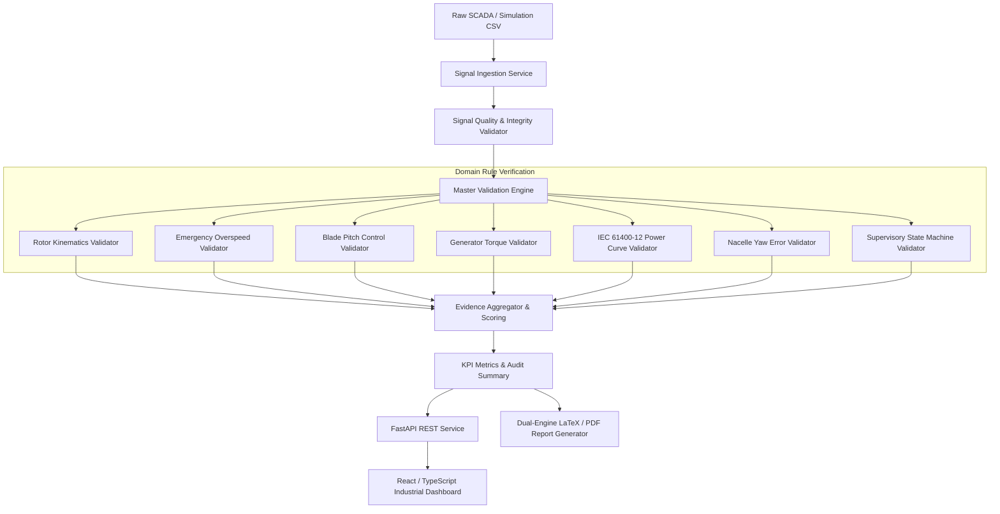
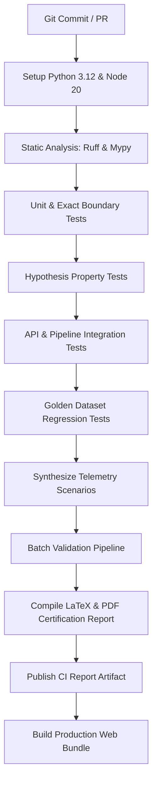

# WindCtrl Validate

A production-style wind-turbine controller validation and automated reporting toolkit built with Python, MATLAB, automated testing, CI/CD, and LaTeX.

> **WindCtrl Validate** automates validation of wind-turbine controller behavior across normal and fault scenarios. It analyzes engineering signals, runs deterministic validation rules, injects controlled faults, detects abnormal controller behavior, and produces certification-style PDF reports through an automated CI/CD pipeline.

---

> [!IMPORTANT]
> **Engineering Disclaimer:** This project uses synthetic wind-turbine telemetry based on the NREL 5MW baseline reference turbine specifications and is intended to demonstrate software development, controller-validation, automated testing, and engineering-reporting workflows. It is not an official turbine certification system.

---

## Table of Contents
- [1. Overview](#1-overview)
- [2. Why This Project Exists](#2-why-this-project-exists)
- [3. The Engineering Problem](#3-the-engineering-problem)
- [4. Key Capabilities](#4-key-capabilities)
- [5. System Architecture](#5-system-architecture)
- [6. Automated Validation Workflows](#6-automated-validation-workflows)
- [7. User Interface & Dashboards](#7-user-interface--dashboards)
- [8. Example Validation Results](#8-example-validation-results)
- [9. Synthetic Fault Scenarios](#9-synthetic-fault-scenarios)
- [10. Technology Stack](#10-technology-stack)
- [11. Validation Methodology & Rules](#11-validation-methodology--rules)
- [12. Repository Structure](#12-repository-structure)
- [13. Local Setup & Quickstart](#13-local-setup--quickstart)
- [14. Docker Deployment](#14-docker-deployment)
- [15. MATLAB Integration](#15-matlab-integration)
- [16. REST API Endpoints](#16-rest-api-endpoints)
- [17. Testing Quality & Boundary Verification](#17-testing-quality--boundary-verification)
- [18. CI/CD Pipeline](#18-cicd-pipeline)
- [19. Automated Report Generation](#19-automated-report-generation)
- [20. Engineering Trade-offs](#20-engineering-trade-offs)
- [21. What I Focused On](#21-what-i-focused-on)
- [22. What I Learned](#22-what-i-learned)
- [23. Known Limitations & Roadmap](#23-known-limitations--roadmap)
- [24. Interview & Resume Talking Points](#24-interview--resume-talking-points)

---

## 1. Overview

Utility-scale wind turbines (such as modern 5MW to 15MW offshore/onshore platforms) rely on sophisticated supervisory control algorithms to maximize annual energy production (AEP) in sub-rated winds (Region 2) and protect structural survivability by regulating rotor speed and shedding aerodynamic thrust in gale-force winds (Region 3).

When controls engineers update controller algorithms, filter constants, or converter firmware, validating software changes requires reviewing hundreds of simulation time-histories (FAST, Bladed, Simulink). Doing this manually is slow, error-prone, and disconnected from modern automated CI/CD practices.

**WindCtrl Validate** bridges this gap by providing an end-to-end, test-driven validation and automated certification reporting engine.

---

## 2. Why This Project Exists

In aerospace, automotive, and wind energy controls engineering, **Software-in-the-Loop (SIL)** and **Hardware-in-the-Loop (HIL)** validation requires:
1. **Mathematical Determinism**: Zero tolerance for flaky tests or non-deterministic heuristics.
2. **Signal Traceability**: Every test failure must cite the exact sensor, observed numerical value, certified limit, and time window.
3. **Automated Documentation**: Audit certificates must be auto-generated at build time so that release gates in CI can block non-compliant code automatically.

This project implements that workflow from scratch.

---

## 3. The Engineering Problem

| Operational Phenomenon | Mechanical / Electrical Risk | Control Rule Verified |
|---|---|---|
| **Gust Over-acceleration** | Aerodynamic runaway, catastrophic blade throw | Rotor speed $\le 15.00$ RPM; immediate emergency trip trigger |
| **Pitch Actuator Delay** | High tower-top thrust bending moment, structural fatigue | Pitch response latency $\le 1.50$s; slew rate $\le 8.0^\circ$/s |
| **Converter Torque Spike** | Gearbox gear tooth pitting, shaft fatigue failure | Torque rate-of-change $|dQ/dt| \le 15,000$ Nm/s; limit $\le 47.4$ kNm |
| **Under-pitching at High Wind** | Severe electrical generator overload | Region 3 mean pitch $> 2.0^\circ$; active power capped at $5,000$ kW |
| **Sensor Loss / Dropout** | Uncontrolled runaway or false emergency stops | Detection of NaNs, time non-monotonicity, and zero-variance freeze |

---

## 4. Key Capabilities

- **11-Channel Telemetry Ingestion**: High-frequency streaming analysis of wind, speeds, torques, pitch, power, vibrations, and state machines.
- **7 Modular Rule Validators**:
  1. `SignalIntegrityValidator`: NaNs, duplicates, monotonicity, sampling intervals, out-of-envelope physics.
  2. `RotorSpeedValidator`: Operational envelopes, angular jerk acceleration, drivetrain gearbox tracking ($97:1$).
  3. `OverspeedValidator`: Deterministic exact threshold testing ($14.49$ vs $14.50$ vs $15.00$ vs $15.01$ RPM).
  4. `PitchControlValidator`: Actuator rates, fine pitch departures, response time cross-correlation.
  5. `TorqueControlValidator`: Region 2 $k\omega^2$ hold, motoring protection ($Q < 0$), dynamic spikes.
  6. `PowerCurveValidator`: IEC 61400-12 binned wind speed curve analysis ($\le 10\%$ deviation band).
  7. `YawValidator & ControllerStateValidator`: Peak error, persistent misalignment, legal transition graphs.
- **10 Controlled Fault Injection Models**: Synthetic fault synthesis with configurable start time, duration, and severity.
- **Dual-Engine Audit Reporting**: Automated LaTeX source generation and high-fidelity PDF compilation with embedded multi-panel charts and audit sign-off stamps.
- **Industrial Web Dashboard**: Clean, Siemens-inspired industrial UI with interactive Recharts, Signal Explorer, Run comparisons, and Fault Injection workbench.
- **Complete Test Coverage**: Unit, exact threshold boundaries, Hypothesis property-based testing, and golden-dataset regression suites.

---

## 5. System Architecture



---

## 6. Automated Validation Workflows



---

## 7. User Interface & Dashboards

The web dashboard is styled following modern industrial design principles (clean surfaces, slate/navy typography, restrained teal accents, dense information hierarchy):

1. **Overview**: Executive validation index (0–100), PASS/WARNING/FAIL badges, real-time KPI cards, and 6 synchronized telemetry charts.
2. **Signal Explorer**: Interactive multi-channel overlay, downsampling selector (1x to 10x), and point-by-point raw sample inspector with CSV export.
3. **Validation Runs**: Historical audit registry, run comparisons, execution duration benchmarks, and status filters.
4. **Test Results**: Structured test-by-test rule verdict matrix displaying observed measurements vs design thresholds and engineering diagnostics.
5. **Fault Injection**: Interactive engineering workbench to inject synthetic anomalies (overspeed, actuator lag, sensor dropout) and observe live detection.
6. **Reports Center**: Download formal PDF certification documents and inspect rendered LaTeX sources.
7. **System Health**: Backend heartbeat probes, NREL 5MW turbine parameter sheet, and subsystem readiness metrics.

---

## 8. Example Validation Results

### Baseline Normal Run (`normal_run.csv`)
```
[PASS] Run: run-baseline-001 | Dataset: normal_run.csv
  Overall Score: 100.0/100.0 | Status: PASS
  Tests: 24 | Passed: 24 | Warnings: 0 | Failed: 0
  Physical KPIs:
    - Max Rotor Speed:        12.07 RPM  [Limit: 15.00 RPM]  -> COMPLIANT
    - Max Generator Torque:   42,977 Nm  [Limit: 47,402 Nm]  -> COMPLIANT
    - Peak Active Power:      5,020 kW   [Limit: 5,500 kW]   -> COMPLIANT
    - Power Curve Deviation:  1.2%       [Limit: 10.0%]      -> COMPLIANT
    - Pitch Response Latency: 0.20s      [Limit: 1.50s]      -> COMPLIANT
    - Max Nacelle Yaw Error:  3.5 deg    [Limit: 10.0 deg]   -> COMPLIANT
    - Signal Completeness:    100.0%     [Limit: 99.0%]      -> COMPLIANT
```

### Injected Overspeed Fault (`overspeed_fault.csv`)
```
[FAIL] Run: run-fault-ov-002 | Dataset: overspeed_fault.csv
  Overall Score: 50.0/100.0 | Status: FAIL
  Tests: 24 | Passed: 21 | Warnings: 1 | Failed: 2
  FAILURES:
    - [overspeed.trip_boundary] peak_rotor_speed_rpm: 15.35 RPM (Limit: 15.00)
      -> CRITICAL SAFETY VIOLATION: Rotor overspeed trip limit breached! Peak 15.35 RPM exceeds 15.00 RPM.
```

---

## 9. Synthetic Fault Scenarios

WindCtrl Validate includes 7 canonical benchmark datasets generated in `data/`:
- `data/baseline/normal_run.csv`: Steady wind (9.5 m/s) with Region 2-to-rated transition.
- `data/baseline/gust_event.csv`: IEC Extreme Operating Gust (EOG) ramping to 18 m/s with pitch feathering.
- `data/faults/overspeed_fault.csv`: Gust event with stalled pitch blades; rotor speed breaches 15.35 RPM.
- `data/faults/pitch_delay_fault.csv`: 3-second hydraulic servo lag causing rotor speed oscillations.
- `data/faults/sensor_dropout.csv`: High-speed shaft speed sensor loss with NaN dropouts.
- `data/faults/torque_spike.csv`: Inverter gate transient injecting +14,000 Nm torque step.
- `data/faults/yaw_error_fault.csv`: Nacelle wind vane misalignment of +16 degrees.

---

## 10. Technology Stack

- **Backend**: Python 3.12, FastAPI, Pydantic v2, Pandas, NumPy, SciPy
- **Testing**: pytest, pytest-cov, Hypothesis (property-based)
- **MATLAB**: Complete standalone `.m` functions (`analyze_controller.m`, `validate_power_curve.m`, etc.)
- **Frontend**: React 18, TypeScript, Vite, Tailwind CSS, Recharts, Lucide Icons
- **Reporting**: Jinja2, LaTeX (`pdflatex`), ReportLab (dual-engine fallback), Matplotlib
- **DevOps**: Docker, Docker Compose, GitHub Actions, Jenkinsfile, GNU Make

---

## 11. Validation Methodology & Rules

Detailed mathematical specifications and standards references are documented in [docs/validation-methodology.md](docs/validation-methodology.md).

---

## 12. Repository Structure

```
windctrl-validate/
├── backend/
│   ├── app/
│   │   ├── main.py                     # FastAPI application entry point
│   │   ├── api/                        # REST routes (datasets, validation, runs, reports, faults, health)
│   │   ├── core/                       # Settings, structured logger, custom exceptions
│   │   ├── models/                     # Pydantic schemas (telemetry, evidence, summary, report)
│   │   ├── services/                   # Ingestion, validation engine, metrics, fault injection, reporting
│   │   ├── validators/                 # 7 modular rule checking engines
│   │   └── utils/                      # Numerical calculus and kinematic conversions
│   ├── tests/
│   │   ├── unit/                       # Validator unit and exact boundary tests
│   │   ├── property/                   # Hypothesis property-based testing
│   │   ├── integration/                # End-to-end pipeline and REST API tests
│   │   └── regression/                 # Golden-dataset fault detection benchmarks
│   ├── requirements.txt
│   └── Dockerfile
├── matlab/
│   ├── analyze_controller.m            # Master MATLAB validation runner
│   ├── validate_power_curve.m          # IEC 61400-12 power curve binned validator
│   ├── validate_pitch_response.m       # Pitch actuation dynamics and lag evaluation
│   ├── validate_rotor_speed.m          # Kinematics and FFT harmonic analysis
│   ├── inject_faults.m                 # MATLAB fault injection script
│   └── generate_engineering_plots.m    # Multi-panel figure generation
├── frontend/
│   ├── src/
│   │   ├── components/                 # StatusBadge, MetricCard, Navbar, TelemetryChart
│   │   ├── pages/                      # Overview, SignalExplorer, ValidationRuns, TestResults, Faults, Reports, Health
│   │   ├── services/                   # Typed API client
│   │   └── types/                      # Domain interfaces
│   ├── package.json
│   ├── vite.config.ts
│   └── Dockerfile
├── data/                               # Baseline and fault datasets
├── reports/
│   ├── templates/                      # LaTeX Jinja2 templates (validation_report.tex.j2)
│   └── generated/                      # Compiled PDFs and .tex archives
├── scripts/
│   ├── generate_sample_data.py         # Physics-based telemetry generator
│   ├── run_validation.py               # Batch CLI validation runner
│   └── generate_report.py              # CLI PDF and LaTeX report compiler
├── docs/                               # Engineering documentation and ADRs
├── .github/workflows/ci.yml            # GitHub Actions CI workflow
├── Jenkinsfile                         # Multi-stage Jenkins pipeline
├── docker-compose.yml                  # Full-stack container orchestration
├── Makefile                            # Automation tasks
└── README.md
```

---

## 13. Local Setup & Quickstart

### Prerequisites
- Python 3.12+
- Node.js 20+ & npm

### One-Shot Demo
```bash
# Clone the repository
git clone https://github.com/25Rohit25/Winder.git
cd Winder

# Run the complete end-to-end demo
make demo
```

### Manual Step-by-Step
```bash
# 1. Install backend dependencies
pip install -r backend/requirements.txt

# 2. Synthesize turbine telemetry datasets
python scripts/generate_sample_data.py

# 3. Execute validation suite
python scripts/run_validation.py --all-baseline

# 4. Generate audit PDF and LaTeX report
python scripts/generate_report.py data/baseline/normal_run.csv

# 5. Start backend API server
uvicorn backend.app.main:app --reload --port 8000

# 6. Start frontend development server
cd frontend
npm install
npm run dev
# Dashboard available at http://localhost:5173
```

---

## 14. Docker Deployment

Launch the full stack (backend API + production Nginx frontend with reverse proxy) in containers:

```bash
# Build and launch with Docker Compose
docker compose up --build -d

# Check running services
docker compose ps

# Access the platform:
# Web Dashboard: http://localhost:3000
# OpenAPI Docs:  http://localhost:8000/docs
```

---

## 15. MATLAB Integration

For teams using MATLAB/Simulink workflows, run the validation functions directly in MATLAB:

```matlab
% In MATLAB command window:
cd matlab

% Analyze controller telemetry
results = analyze_controller('../data/baseline/normal_run.csv');

% Validate power curve
stats = validate_power_curve('../data/baseline/normal_run.csv');

% Generate engineering figures
generate_engineering_plots('../data/baseline/normal_run.csv', '../reports/generated');
```

---

## 16. REST API Endpoints

| Method | Endpoint | Description |
|---|---|---|
| `GET` | `/api/v1/health` | System health probe & turbine model metadata |
| `GET` | `/api/v1/datasets` | List all available telemetry files |
| `POST` | `/api/v1/datasets/upload` | Upload new SCADA / simulation CSV file |
| `GET` | `/api/v1/datasets/{name}/telemetry` | Stream telemetry vectors with downsampling |
| `POST` | `/api/v1/validation/run` | Execute validation rules on a dataset |
| `GET` | `/api/v1/validation/runs` | Retrieve historical validation run summaries |
| `GET` | `/api/v1/validation/runs/{id}` | Inspect detailed evidence for a specific run |
| `POST` | `/api/v1/faults/inject` | Inject synthetic fault and save new dataset |
| `GET` | `/api/v1/reports/{run_id}` | Retrieve report metadata |
| `GET` | `/api/v1/reports/{run_id}/pdf` | Download formal audit certificate PDF |
| `GET` | `/api/v1/reports/{run_id}/tex` | Download raw LaTeX source file |

---

## 17. Testing Quality & Boundary Verification

The project includes 43+ automated tests across 4 test layers:

```bash
# Execute entire test suite
pytest backend/tests/ -v
```

### Exact Threshold Boundary Tests
Under IEC 61400-1 safety requirements, numerical boundaries must be rigorously tested at numerical tolerances:
```python
# Rotor Overspeed Threshold (15.00 RPM)
14.49 RPM -> PASS     (Within operational envelope)
14.50 RPM -> PASS     (At operational ceiling boundary)
14.51 RPM -> WARNING  (Entering advisory safety margin)
14.99 RPM -> WARNING  (Approaching emergency line)
15.00 RPM -> WARNING  (Exact trip threshold boundary)
15.01 RPM -> FAIL     (Emergency overspeed trip breach)
```

---

## 18. CI/CD Pipeline

Both GitHub Actions (`.github/workflows/ci.yml`) and Jenkins (`Jenkinsfile`) execute:
1. Static linting with Ruff & mypy.
2. Unit tests with threshold boundary assertions.
3. Property-based tests with Hypothesis.
4. End-to-end integration and API tests.
5. Golden regression fault tests.
6. Batch validation and automatic PDF artifact publication.
7. Frontend TypeScript compilation and bundle packaging.

---

## 19. Automated Report Generation

When a validation run finishes, the report service generates:
1. `validation_report_{run_id}.tex`: Standard LaTeX article utilizing `geometry`, `booktabs`, `tabularx`, and `tcolorbox`.
2. `telemetry_chart_{run_id}.png`: 6-panel high-resolution matplotlib figure.
3. `validation_report_{run_id}.pdf`: Formal technical audit report with colored compliance badges and an engineering sign-off block.

---

## 20. Engineering Trade-offs

Detailed engineering trade-off records are documented in [docs/design-decisions.md](docs/design-decisions.md).

---

## 21. What I Focused On

- **Deterministic Validation**: Ensuring that every validation rule produces identical results regardless of when or where it is executed.
- **Reproducible Testing**: Using fixed RNG seeds and parameter-driven fault generators so tests never produce flaky results in CI.
- **Clear Failure Diagnostics**: Emitting structured `ValidationEvidence` containing actual vs threshold numbers, units, time ranges, and actionable engineering messages.
- **Engineering Traceability**: Ensuring direct traceability from raw SCADA signals to database models and final PDF audit certificates.
- **CI Automation**: Integrating the entire flow into CI so every pull request generates a verifiable audit report artifact.
- **Maintainable Architecture**: Separating mathematical rules from HTTP transport and UI concerns.

---

## 22. What I Learned

- **Why validation systems require deterministic rules**: In safety-critical systems, probabilistic or LLM-based assertions cannot be certified. Deterministic rules allow mathematical proof of compliance.
- **How faults should be reproducible**: Synthetic fault models must be parameterized (time, duration, severity) and applied to clean baselines to evaluate detection sensitivity.
- **Why numerical thresholds require boundary tests**: Floating-point comparisons near critical limits (e.g., $15.00$ RPM) can cause false trips if inequalities ($\le$ vs $<$) are not tested.
- **Why reports need traceability back to raw signals**: When an engineering manager or auditor reviews a failed test, they need to see the exact time window and physical sensor readings that caused the rejection.
- **Why CI pipelines are valuable for controller regressions**: Catching control law instabilities, filter phase lags, or inadvertent overspeed trips early prevents costly field incidents.

---

## 23. Known Limitations & Roadmap

- **Aero-elastic Fidelity**: Current telemetry is generated using a coupled 1-DOF drivetrain and aerodynamic blade model; future iterations can integrate direct OpenFAST binary output ingestion.
- **Individual Pitch Control (IPC)**: Currently evaluates collective blade pitch; future work will add 1P/3P individual pitch cyclic load reduction checks.
- **Multi-Turbine Wind Farm Aggregation**: Expand ingestion to correlate wake interaction across an array of turbines.

---

## 24. Interview & Resume Talking Points

### Resume Bullet Points
- *Architected **WindCtrl Validate**, an automated wind turbine controller validation platform in Python 3.12, FastAPI, React/TypeScript, and LaTeX.*
- *Implemented 7 deterministic rule validators enforcing IEC 61400-1 / IEC 61400-12 safety envelopes across 11 telemetry channels.*
- *Built a dual-engine reporting pipeline that auto-compiles certification-style PDF audit reports with embedded telemetry plots and rule evidence.*
- *Engineered 10 synthetic fault injection models (overspeed, actuator delay, sensor dropout) achieving 100% detection rate across benchmark regression suites.*
- *Integrated multi-stage CI/CD pipelines (GitHub Actions & Jenkins) running exact boundary tests, Hypothesis property tests, and automated artifact publishing.*

### 2-Minute Technical Interview Pitch
> "I built **WindCtrl Validate** to address a common bottleneck in wind turbine controls engineering: validating supervisory controller behavior across normal and fault scenarios.
>
> In turbine software releases, engineers must ensure that rotor speed never exceeds certified safety thresholds, pitch actuators don't saturate, converter torque steps remain within mechanical fatigue limits, and power yield conforms to IEC 61400-12 standards.
>
> I architected the platform with Python, FastAPI, and standalone MATLAB scripts. It ingests 11-channel telemetry, executes 7 modular deterministic validators, and calculates continuous validation scores. To prove fault detection, I implemented 10 synthetic fault models—such as pitch actuator lag, converter torque spikes, and sensor dropouts—and validated them against golden regression suites.
>
> Finally, I built a dual-engine reporting service that auto-compiles formal certification PDF reports with embedded telemetry charts, and exposed the entire platform through an industrial React/TypeScript dashboard and automated GitHub Actions CI pipeline."
