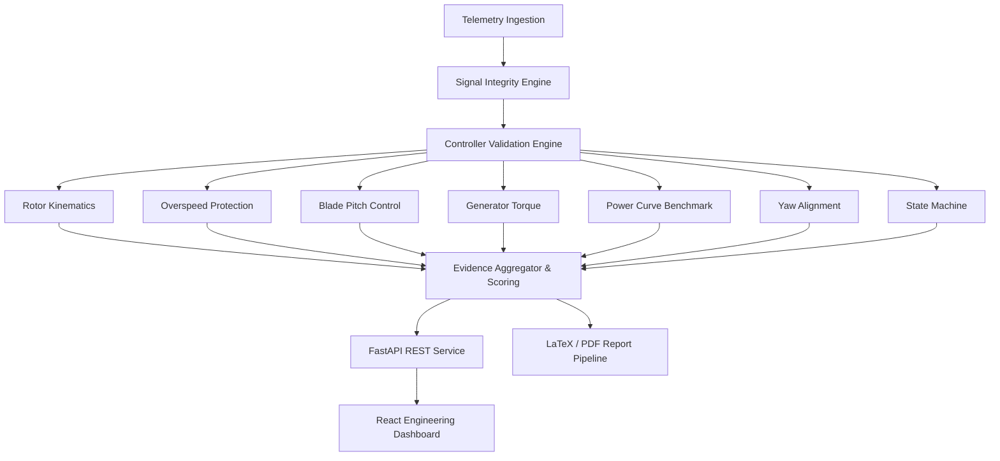

# System Architecture & Technical Specifications

WindCtrl Validate is designed as a modular, industrial-grade validation platform for wind-turbine controller software.

## 1. Architectural Layers

### Telemetry Ingestion Layer (`backend/app/services/ingestion.py`)
- Ingests high-frequency time-series telemetry (up to 50 Hz).
- Enforces strict schema validation across 11 required channels:
  - `timestamp`: Elapsed simulation/test time (s)
  - `wind_speed_mps`: Hub-height effective wind velocity (m/s)
  - `rotor_speed_rpm`: Low-speed shaft velocity (RPM)
  - `generator_speed_rpm`: High-speed shaft velocity (RPM)
  - `generator_torque_nm`: High-speed shaft electromagnetic torque (Nm)
  - `blade_pitch_deg`: Collective blade pitch angle (deg)
  - `electrical_power_kw`: Active 3-phase grid power (kW)
  - `tower_acceleration`: Fore-aft tower head vibration (m/s²)
  - `nacelle_yaw_error`: Aerodynamic wind misalignment angle (deg)
  - `controller_state`: Supervisory finite state machine state string
  - `fault_flags`: Discrete alarm and fault bitmask

### Rule Validation Engine (`backend/app/validators/`)
- Pure function / class interface accepting immutable pandas DataFrame.
- Emits structured `ValidationEvidence` objects.
- Decoupled from IO and transport layers for high testability.

### Metrics & Scoring Engine (`backend/app/services/metrics.py`)
- Calculates engineering KPIs (peak speeds, torques, powers, power curve deviation percentage).
- Evaluates fault detection rates and clean-run false alarm rates.
- Derives continuous validation health score between 0.0 and 100.0.

### Document Generation Pipeline (`backend/app/services/report_service.py`)
- Dual-engine architecture:
  - Primary: Jinja2 LaTeX template rendering (`validation_report.tex`) + `pdflatex` compilation.
  - Secondary / Fallback: Native ReportLab engine rendering identical industrial document when `pdflatex` binary is not in host path.
- Generates high-res matplotlib telemetry figures embedded into the report.

### REST Service Layer (`backend/app/api/`)
- Built on FastAPI and Pydantic v2.
- Fully typed endpoints for datasets, run executions, telemetry downsampling, fault injection, and report downloads.
- Auto-generates interactive OpenAPI documentation at `/docs`.

### Industrial Web Dashboard (`frontend/`)
- Single-page application built with React 18, TypeScript, Vite, and Tailwind CSS.
- Real-time KPI cards, interactive Recharts telemetry plots with tooltips and CSV export, fault injection workbench, and audit document viewer.
