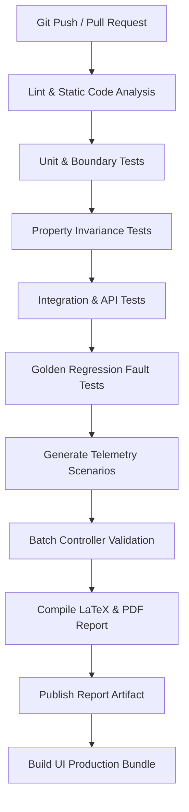

# CI/CD Automated Validation Workflow

WindCtrl Validate implements an automated engineering gatekeeper workflow across both **GitHub Actions** (`.github/workflows/ci.yml`) and **Jenkins** (`Jenkinsfile`).

## Pipeline Stages

1. **Checkout & Setup**: Installs Python 3.12, Node.js 20, TeX Live compiler utilities, and project dependencies.
2. **Lint**: Enforces formatting standards using Ruff and type-checking with mypy.
3. **Unit Tests (`backend/tests/unit/`)**: Verifies exact mathematical threshold boundary conditions (e.g., 14.99 vs 15.00 vs 15.01 RPM) and individual validator logic.
4. **Property Tests (`backend/tests/property/`)**: Uses Hypothesis to assert numerical invariance across 300+ randomized parameter samples.
5. **Integration Tests (`backend/tests/integration/`)**: Validates the end-to-end telemetry ingestion, rule evaluation, and FastAPI REST endpoint contracts.
6. **Regression Fault Tests (`backend/tests/regression/`)**: Executes validation across the 7 benchmark golden datasets, ensuring zero false positives on clean runs and guaranteed detection of injected faults.
7. **Telemetry Synthesis**: Automatically generates benchmark datasets using deterministic random seeds.
8. **Batch Validation & Reporting**: Executes the validation engine, builds LaTeX source, compiles the formal certification PDF, and uploads reports as CI artifacts.
9. **UI Production Build**: Builds and packages the Vite/React application bundle into `frontend/dist/`.
