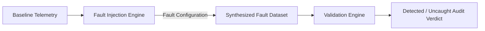

# Synthetic Fault Injection Models

WindCtrl Validate implements 10 reproducible physical, actuator, and sensor fault models to prove deterministic detection capability.

## Fault Catalog

| ID | Model Name | Physics / Mechanism | Targeted Channel | Severity Scaling | Detection Rule |
|---|---|---|---|---|---|
| `ROTOR_OVERSPEED` | Aerodynamic Overspeed | Pitch fails to feather during gust, aerodynamic torque accelerates rotor past $15.0$ RPM. | `rotor_speed_rpm`, `generator_speed_rpm` | Multiplies acceleration boost ($+2.5 \cdot s$ RPM) | `overspeed.trip_boundary` |
| `PITCH_ACTUATOR_DELAY` | Pitch Actuator Lag | Hydraulic valve stiction or servo lag causing 3-second lag in blade pitch regulation. | `blade_pitch_deg` | Increases lag window and fine pitch hold | `pitch_control.response_time`, `pitch_control.above_rated_response` |
| `SENSOR_DROPOUT` | Telemetry Dropout | High-speed shaft encoder connection lost; telemetry drops to NaN. | `generator_speed_rpm` | Channel-selective NaN dropout | `signal_integrity.nan_dropout` |
| `SENSOR_FREEZE` | Sensor Freeze | Ultrasonic anemometer frozen due to sensor freeze / frost without heating flag. | `wind_speed_mps` | Zero-variance window | `signal_integrity.sensor_freeze` |
| `TORQUE_SPIKE` | Converter Step Discontinuity | Inverter bridge gate firing anomaly resulting in $+14,000$ Nm torque transient. | `generator_torque_nm` | Multiplies spike amplitude | `torque_control.torque_spikes`, `torque_control.max_limit` |
| `NOISY_WIND_SENSOR` | Anemometer Noise | High-frequency white noise due to loose nacelle cup anemometer mount. | `wind_speed_mps` | Increases noise variance | `signal_integrity.sampling_continuity` |
| `YAW_MISALIGNMENT` | Yaw Drive Failure | Yaw brake seized or wind vane calibrated with fixed angular offset ($+16^\circ$). | `nacelle_yaw_error` | Increases angular bias | `yaw.peak_error`, `yaw.persistent_misalignment` |
| `POWER_UNDERPERFORMANCE` | Sub-rated Yield | Generator stator winding derating or blade aerodynamic stall degradation. | `electrical_power_kw` | Multiplies yield deficit | `power_curve.binned_deviation`, `power_curve.rated_power_cap` |
| `TIMESTAMP_GAP` | Telemetry Drop Frame | Buffer overrun in datalogger causing missing sampling window ($> 1.0$ s). | `timestamp` | Increases dropped rows | `signal_integrity.sampling_continuity` |
| `CONTROLLER_STATE_FAULT` | Illegal State Jump | State machine race condition causing transition to `IDLE` during full load operation. | `controller_state` | Forces illegal state enum | `controller_state.transitions` |
